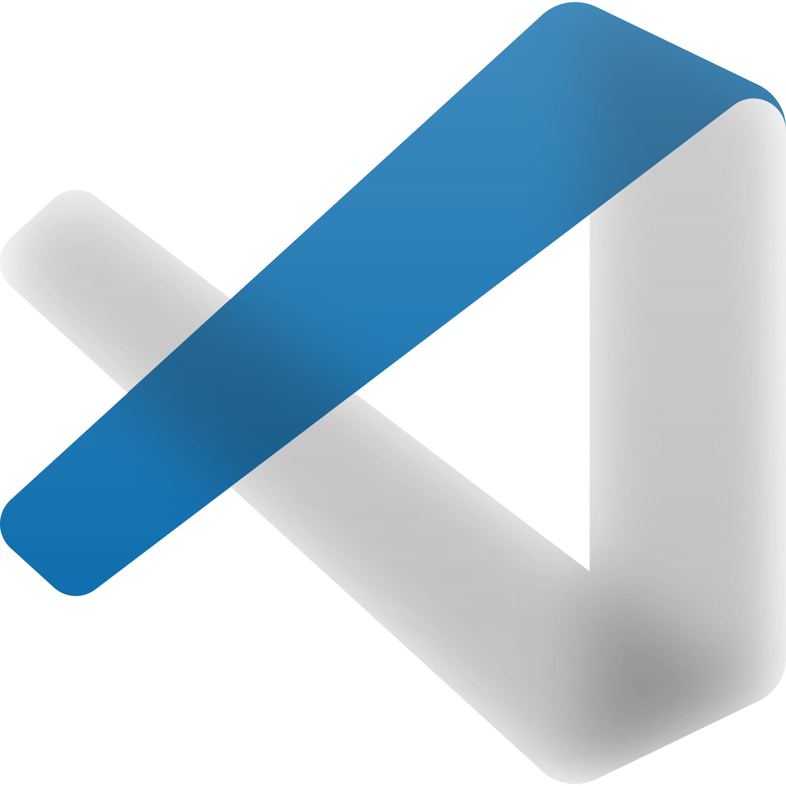

<!-- encabezado Practicando MarkDown-->
# mi titulo h1
## mi titulo h2
### mi titulo h3
#### mi titulo h4
##### mi titulo h5
###### mi titulo h6

esto es textto inclinado *italica*

esto es texto **negrilla**

esto es ~~texto tachado~~

listas ordenadas
* manzana
    * manzana 2
* naranja
    * naranja 2
* etc

1. manzana
    1. manzana
2. naranja
3. etc

[google.com](https://www.google.com)

[google.com](https://www.google.com "probando MARKDOWN")

> esta es un cita de texto para que lo leas con atención

---
___

`console.log('hello word')`

```typescript
<body>
    <header>
        <a href="#" class="logo">
            
            <h2 class="nombre-empresa">Nombre compañia</h2>
        </a>
        <nav>
            <a href="" class="nav-link">Inicio</a>
            <a href="" class="nav-link">Sobre nosotros</a>
            <a href="" class="nav-link">Contacto</a>
        </nav>
    </header>
    <h3>hola mundo</h3>
    <footer class="pie de pantalla">Pie de pantalla</footer>
</body>
```
```python
print("hello word")
```
```html
<h1>hello word</h1>
```

|tablas|area|costo|
|--|:------:|:------:|
|col 3 is|alinea-derec|$120
|col 4 is|centrol|$15
|zebra|son animales|$20



<!-- Github MarkDown-->
* [x] tarea 1
* [] tarea 2
* [] tarea 3

@fazweg :smiley:

[^1]: This is the footnote.

==very important words==
